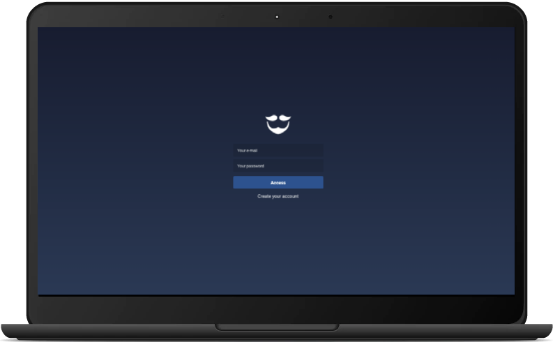
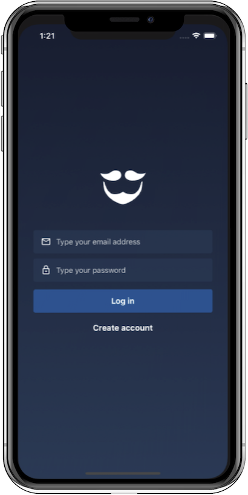

<h1 align="center">
 
  GoBarber
</h1>

<h2 align="center">
  
  
</h2>

  

Repository containing backend, frontend and mobile of an application developed in the [Rockeseat Bootcamp](https://rocketseat.com.br/gostack).

## :page_with_curl: About

This is an application that connects barbers and customers. The back-end was made with Node.JS, Frontend with ReactJS and mobile with React Native. The web part of this application is designed for barber to their agenda, profile. Customers can use the mobile application to book a service with their chosen barber, and, cancel and edit their profiles.

## Project versions

- [Backend](https://github.com/diazevedo/gobarber)
- [Frontend](https://github.com/diazevedo/gobarber-web)
- [Mobile](https://github.com/diazevedo/gobarber-mobile)

## Technologies

The main technologies used in this project are:

### :open_file_folder: Backend

- [Node](https://nodejs.org/en/)
- [JSON Web Token](https://github.com/auth0/node-jsonwebtoken)
- [Sucrase](https://github.com/alangpierce/sucrase)
- [Nodemon](https://nodemon.io/)
- [PostgreSQL](https://www.postgresql.org/)
- [Redis](https://redis.io/)
- [Express](https://expressjs.com/)
- [MongoDB](https://www.mongodb.com/)
- [Nodemailer](https://nodemailer.com/about/)
- [Yup](https://github.com/jquense/yup)
- [Date-fns](https://date-fns.org/)
- [Bee-queue](https://github.com/bee-queue/bee-queue)
- [Multer](https://github.com/expressjs/multer)
- [Docker](https://www.docker.com/)

### :computer: Frontend

- [React](https://reactjs.org/)
- [React Select](https://react-select.com/)
- [React Toastify](https://github.com/fkhadra/react-toastify)
- [Redux](https://redux.js.org/introduction/getting-started)
- [Redux Saga](https://redux-saga.js.org/)
- [Styled Components](https://styled-components.com/)

### :iphone: Mobile

- [React Native](http://facebook.github.io/react-native/)
- [Redux](https://redux.js.org/)
  - [Redux Saga](https://redux-saga.js.org/)
- [React Navigation](https://reactnavigation.org/)
- [React Native Gesture Handler](https://kmagiera.github.io/react-native-gesture-handler/)
- [Axios](https://github.com/axios/axios)
- [Prop Types](https://github.com/facebook/prop-types)
- [Reactotron](https://github.com/infinitered/reactotron)
  - [reactotron-react-native](https://github.com/infinitered/reactotron/blob/master/docs/quick-start-react-native.md)
  - [reactotron-redux](https://github.com/infinitered/reactotron/blob/master/docs/plugin-redux.md)
  - [reactotron-redux-saga](https://github.com/infinitered/reactotron/blob/master/docs/plugin-redux-saga.md)
- [OneSignal](https://documentation.onesignal.com/docs)
- [React Native Module for CodePush](https://github.com/microsoft/react-native-code-push)

# :hammer: Running the project

Go to each project and in their README's you will find the instructions.

As both frontend and mobile depends on the API running I recommend you to start from there.

:bulb: Feel free to comment or to contribute with this project any thoughts on how to improve are welcome.
